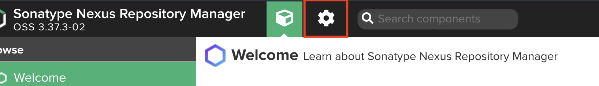
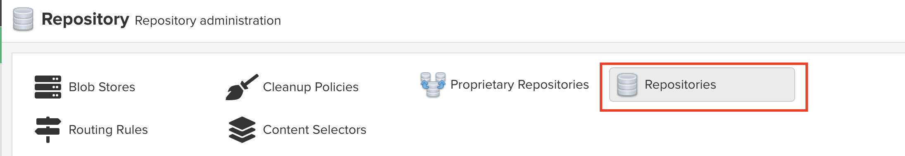
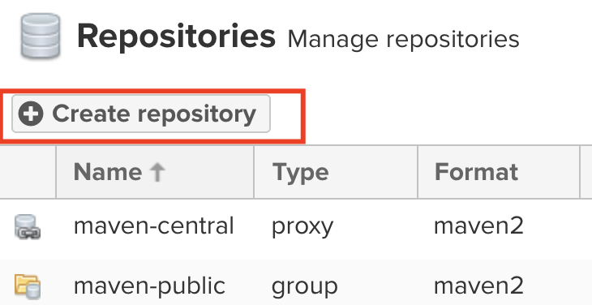
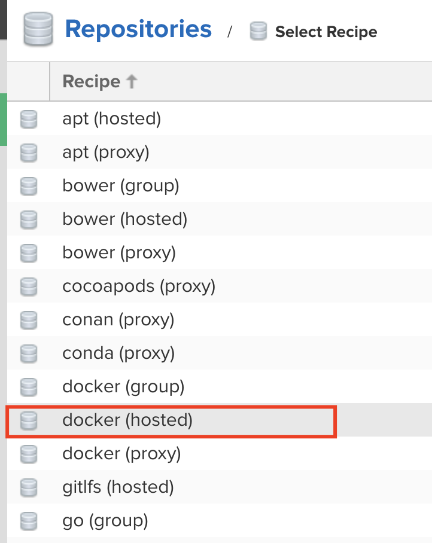
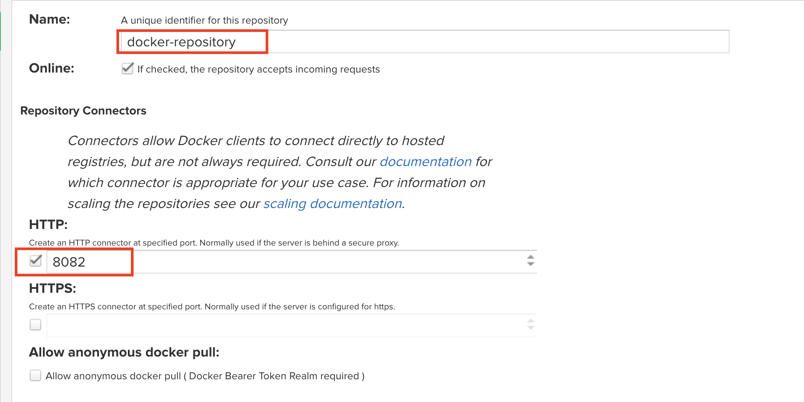
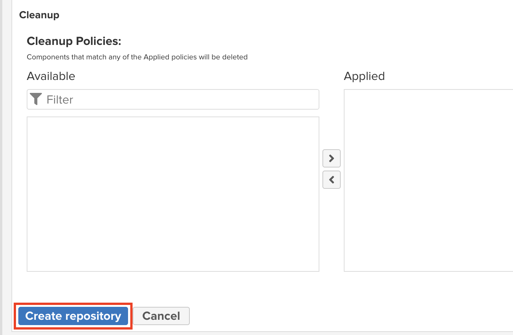
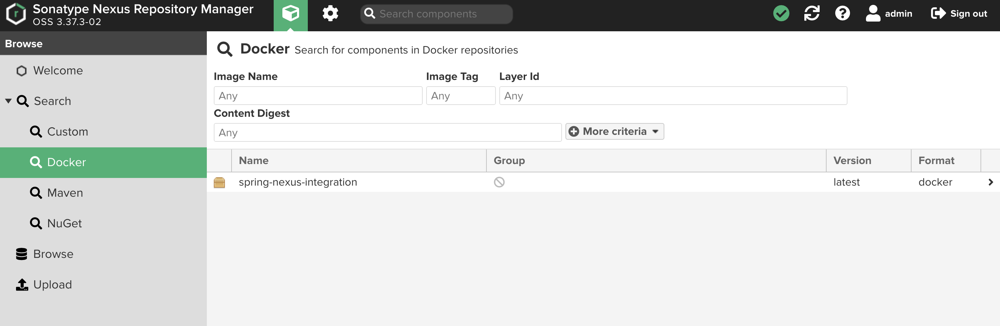

# Integrating Spring with Nexus as proxy and staging repository using Docker

In this tutorial I will show you how to configure spring-boot application and Nexus server to be used as a proxy for dependencies and as a docker repository that will store built images of your application. 

## Prerequisites

* docker
* java
* spring project
* maven

## Starting Nexus

First of all we need to start Nexus server as a Docker container. We use official Sonatype's image called `sonatype/nexus3`. We also need to expose internal container ports to a host's environment so that we can interact with it. Port `8081` will be used as default Nexus port and `8082` is for Docker repository. We also specify volume with `-v` option. This will ensure that even if containers stops, all our data will persist.

```
docker run -p 8081:8081 -p 8082:8082 --name nexus --detach -v nexus-data:/nexus-data sonatype/nexus3
```

After the server starts you should log in to the server. 
1. In your browser go to address `localhost:8081`. 
2. Click `Sign in`.
3. In your terminal enter command 
```
docker container exec -it nexus more /nexus-data/admin.password
```
4. Copy the content, this is your admin password for now.
5. In the browser type in login: `admin` and password is the one you just copied from terminal.
6. Click `Sign in`.
7. Click `Next`.
8. Enter twice the new password for your admin account. Click `Next`. 
9. Check `Enable anonymous access` and click `Next`.
10. Then click `Finish`. You are now logged in.

## Configuring Nexus Docker repository

1. Sign in to Nexus at `localhost:8081`.
2. Go to `Create Repository` page by clicking the following buttons:
   
   
   
3. Next choose `docker (hosted)` recipe.
   
4. Enter repository name (I chose `docker-repository`). You also need to allow HTTP access on port `8082` (that's the one we allowed earlier in `docker run` command).
   
5. Click `Create repository` and you are good to go. If you try to deploy an image immediately after creating your repository it might fail because Nexus needs some time to set everything up and it does so in the background.
   

## Deploying Spring application to Nexus

When you have you Nexus server set up, you can proceed with packaging and deploying your application. Make sure that in the root directory you have `Dockerfile` present. It should state at least which image to use and run your application's `.jar` file. Example `Dockerfile` used in this tutorial:
```dockerfile
FROM openjdk:11 as base

ARG JAR_FILE=target/*.jar
COPY ${JAR_FILE} application.jar
EXPOSE 8080
ENTRYPOINT ["java","-jar","/application.jar"]
```

Then we can proceed with actual build and deploy process. 
1. First to package your project execute
`mvn clean package` command. 
2. Next we need to create a new image that will start our application inside Docker container.

```
docker build -t localhost:8082/spring-nexus-integration .
```
*\* substitute spring-nexus-integration with the image name you want*

3. To verify if the image was created execute `docker images`. You should see image name you entered displayed.
4. Now with the image ready we should first start with connecting our docker daemon to Nexus. Execute:
```
docker login -u admin localhost:8082
```
When prompted for password, please enter your admin password.

5. The last step is to push our image to Nexus repository.
```
docker push localhost:8082/spring-nexus-integration  
```

To verify if deployment succeeded, on Nexus site go to the main site. Select `Docker` from the left-hand side menu. You should see your Docker image there.
   