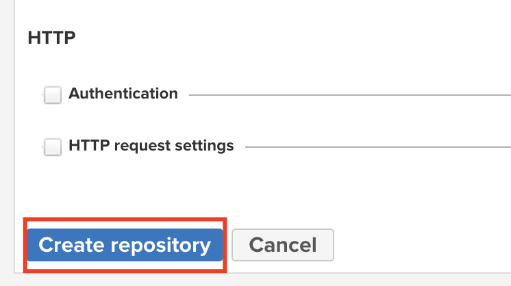

# Integrating Spring backend with Nexus server used as Maven and Docker repository

In this tutorial I will show you how to configure a spring-boot application and a Nexus server to be used as a proxy for dependencies and as a Docker repository for storing built images of your application. Both Spring and Nexus will be containerized.

## Prerequisites

* Docker
* Java
* Spring application
* Maven / Maven wrapper

## Starting Nexus

First of all, we need to start Nexus server as a Docker container. We use official Sonatype's image called `sonatype/nexus3`. We also need to expose internal container ports to a host's environment so that we can interact with it. Port `8081` will be used as default Nexus port and `8082` is for the Docker repository. We also specify volume with `-v` option. This will ensure that even if the container stops, all our data will persist.

```
docker run -p 8081:8081 -p 8082:8082 --name nexus --detach -v nexus-data:/nexus-data sonatype/nexus3
```

After the server starts you should log in. 
1. In your browser go to address `localhost:8081`. 
2. Click `Sign in`.
3. In your terminal enter command 
```
docker container exec -it nexus more /nexus-data/admin.password
```
4. Copy returned content. This is your admin password for now.
5. In the browser type in login: `admin` and password is the one you just copied from the terminal.
6. Click `Sign in`.
7. Click `Next`.
8. Enter twice the new password for your admin account. Click `Next`. 
9. Check `Enable anonymous access` and click `Next`.
10. Then click `Finish`. You are now logged in.

## Configuring Nexus Docker repository

Docker repository can be useful when we want to store and version Docker images in one place. 

1. Sign in to Nexus at `localhost:8081`.
2. Go to `Create Repository` page by clicking the following buttons:
   
   
   
3. Next choose `docker (hosted)` recipe.
   
4. Enter repository name (I chose `docker-repository`). You also need to allow HTTP access on port `8082` (that's the one we allowed earlier in `docker run` command).
   
5. Click `Create repository` and you are good to go. If you try to deploy an image immediately after creating your repository it might fail because Nexus needs some time to set everything up and it does so in the background.
   

## Deploying Spring application to Nexus

When you have you Nexus server set up, you can proceed with packaging and deploying your application. Make sure that in the root directory you have `Dockerfile` present. It should state at least which image to use and run your application's `.jar` file. Example `Dockerfile` used in this tutorial:
```dockerfile
FROM openjdk:11 as base

ARG JAR_FILE=target/*.jar
COPY ${JAR_FILE} application.jar
EXPOSE 8080
ENTRYPOINT ["java","-jar","/application.jar"]
```

Then we can proceed with actual build and deploy process. 
1. First to package your project execute
`mvn clean package` command. 
2. Next we need to create a new image that will start our application inside Docker container.

```
docker build -t localhost:8082/spring-nexus-integration .
```
*\* substitute spring-nexus-integration with the image name you want*

3. To verify if the image was created, execute `docker images`. You should see image with the name you entered.
4. Now with the image ready we should first start with connecting our docker daemon to Nexus. Execute:
```
docker login -u admin localhost:8082
```
When prompted for password, please enter your admin password.

5. The last step is to push our image to Nexus repository.
```
docker push localhost:8082/spring-nexus-integration  
```

To verify if deployment succeeded, on Nexus website go to the main page. Select `Docker` from the left-hand side menu. You should see your Docker image there.


## Configuring proxy server

Nexus proxy is used for caching artifacts (dependencies). This is useful when you are managing a large organization where dozens of people and services are downloading packages from the central repository. When we set up the proxy server we don't longer rely on the central repository. Even if their servers stop working, we can still install cached artifacts. Also, some central repositories temporarily block access for those IPs that overly use their servers. In that case we are forced to set up our own proxy server.

First, let's start with adding Nexus repository.
1. Navigate to `Create repository` page by following screenshots:


2. Now choose `maven2 (proxy)` recipe


3. In the `Name` field enter the name of your repository (I chose `maven-proxy`). Also in the `Remote storage` field add url to the central repository from which we should download artifacts. I used `https://repo1.maven.org/maven2/`.


4. Click `Create repository` and you are good to go.



Now we have to modify maven configuration.
1. Create `settings.xml` file.
2. Add to it following code:
```xml
<settings>
   <mirrors>
      <mirror>
         <id>nexus</id>
         <mirrorOf>*</mirrorOf>
        <!-- If needed, you can modify the address of you Nexus proxy repository here -->
         <url>http://localhost:8081/repository/maven-proxy/</url>
      </mirror>
   </mirrors>
   <profiles>
      <profile>
         <id>nexus</id>
         <repositories>
            <repository>
               <id>central</id>
               <url>http://central</url>
               <releases><enabled>true</enabled></releases>
               <snapshots><enabled>true</enabled></snapshots>
            </repository>
         </repositories>
         <pluginRepositories>
            <pluginRepository>
               <id>central</id>
               <url>http://central</url>
               <releases><enabled>true</enabled></releases>
               <snapshots><enabled>true</enabled></snapshots>
            </pluginRepository>
         </pluginRepositories>
      </profile>
   </profiles>
   <activeProfiles>
      <activeProfile>nexus</activeProfile>
   </activeProfiles>
</settings>
```
If you followed this tutorial one-to-one you only need to copy and paste this configuration. Otherwise, you can modify the url and repository name in the place marked by the comment.
3. Now we have two options. We can either apply those settings to the global maven command and all your projects will use Nexus proxy, or we can just attach it to the maven wrapper included in the project.

   a) **Global mode**
   
   - copy `settings.xml` file into your local maven directory (on mac it's `~/.m2/`)
   - execute maven script using global maven command (eg. `mvn clean install`)

   b) **Project restricted mode**

   - copy `settings.xml` into `.mvn/wrapper/` directory in your project
   - when executing any maven script add `-s .mvn/wrapper/settings.xml` option to the command (eg. `./mvnw clean install -s .mvn/wrapper/settings.xml`)

4. To verify if Nexus cached artifacts go to the main site, select `Maven` from the left-hand side menu. You should see the list of cached artifacts there.


## Summary

Nexus is a great tool that can do much more than just proxying maven artifacts or storing docker images. I hope this tutorial will make it easy for you to integrate Nexus with Spring backend in a containerized environment.

Sample project can be found [here](https://github.com/OlekKapera/spring-nexus-integration).